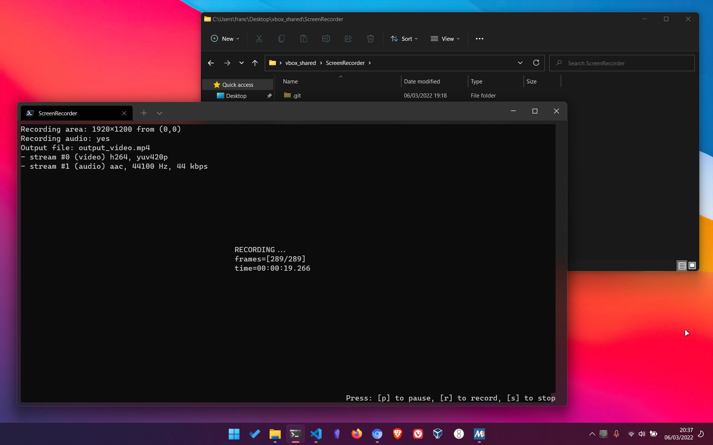

# ScreenRecorder

Project for the ***Programmazione di Sistema*** course at ***Politecnico di Torino***

### Group

- [Francesco Lonardo](https://github.com/francescolonardo) S291039
- [Marco Barca](https://github.com/marcobarca) S281702

## About the Project

**ScreenRecorder** is a project based on two main components:

- the **ScreenRecorder library**, a multiplatform **C++** library, which allows to record the video from the screen and (optionally) the audio from the microphone.
- the **CommandLineInterface library**, a multiplatform **C++** cli frontend, used to interact with the **ScreenRecorder library**.

### ScreenRecorder Library

Composed by **ScreenRecorder.ccp** and **ScreenRecorder.h**, it uses the [**ffmpeg**](https://ffmpeg.org/) libraries to capture the frames (video/audio), to elaborate them, and to save the result in a **.mp4** file.
These libraries are **avcodec**, **avdevice**, **avfilter**, **avformat**, **avutil**, **libswscale** and **libswresample**.

---

It uses two threads for the **video** and two threads for the **audio** (optional) recording.

- **capture packets video**: it gets the raw (encoded) video packets from the **os** virtual device (**x11grab** on Linux, **gdigrab** on Windows and **avfoundation** on Mac OS) and inserts them in a queue.
- **elaborate packets video**: it takes the raw packets, one at a time, from the video queue, and subsequently first performs an **elaboration** (decode and encode) and then **writes** them in the output file.

- **capture packets audio**: it gets the raw (encoded) audio packets from the **os** virtual device (**pulse** on Linux, **dshow** on Windows and **avfoundation** on Mac OS) and inserts them in a queue.
- **elaborate packets audio**: it takes the raw packets, one at a time, from the audio queue, and subsequently first performs an **elaboration** (decode and encode) and then **writes** them in the output file.

It uses one thread for the management/changing of the recording status.

- **change recording status**: it waits for the user's key pressing
  [p] to pause, [r] to record, [s] to stop

---

These are the features offered by the library:

- record **screen video** w/o **microphone audio**
- **pause** and **resume** recording without creating separated files
- allows the user to specify the **size** and the **offsets** of the screen area to be recorded
- allows the user to specify the **output filename** (*the extension must be **.mp4***)
- in case of **internal errors** throws an **exception** with a **description of the error** and **stop the recording**, creating the output video file with what has been recorded till that moment

### CommandLineInterface Library

Composed by **CommandLineInterface.ccp** and **CommandLineInterface.h**, it uses the [**ncurses**](https://en.wikipedia.org/wiki/Ncurses) library to show in the command line an interface for pausing, stopping and resuming the recording.

### CommandLineInterface Screenshots

